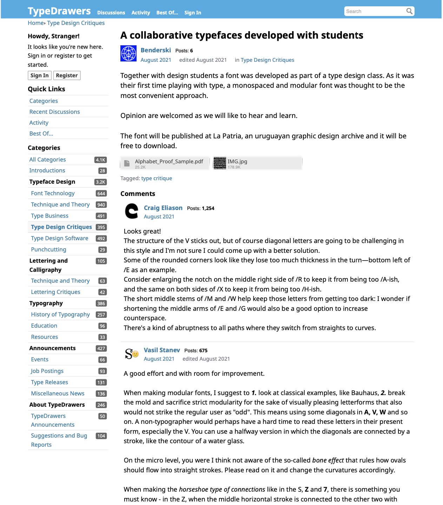

# Character Diversion

**The Platform for Typographic Discourse**

## Introduction

In my proposals, I studied potential relationships between Hebrew and Latin characters. More specifically, I looked at character connections between the Hebrew and Latin script. Within the boundaries of both scripts, those connections exist: ›n‹, ›m‹, and ›h‹ are structurally linked in the Latin script. And so I sought to find out whether characters or character fragments of both Hebrew and Latin are linked or can be linked. I discovered that while certain character groups bear the potential for new relationships, the modification of century-old letterforms and typographic conventions could be quite controversial. To read all about this process, refer to my proposal *Cross-Script Character Relationships*.

After submitting my proposals, I initially looked for the right medium to showcase my considerations. My thought was to create an interactive webpage where the potential character relationships could be presented. My focus soon shifted toward building a proper platform where I could showcase my considerations, but also enable others to respond to those considerations. This way, I thought, others might use the platform and make it their own, discuss their own type projects and ideas of what letter shapes might look like in the future.

My research has shown that the platforms where type designers discuss their work are not designed specifically for typographic discourse. They are either forums that are designed for general discourse with typography being the core topic (e.g. typedrawers.com) or platforms designed for typography but not for discourse (e.g. futurefonts.xyz).

By opening up new ways of typographic discourse, this thesis aims to challenge typographic conventions. It is not intended to suggest that the conventions we adhere to must all be thrown overboard. Discourse may also reinforce conventions: There is a good chance that my proposal to establish new conventional character relationships between Hebrew and Latin will be vehemently criticized and rejected. And if, as Foucault puts it, the »will to truth« (1971, p.10) succeeds through the platform I am creating, all is won.

> »The more things change, the more they stay the same.«
>
> — Jean-Baptiste Alphonse Karr

To guide you through my thought process, I will first explain what conventions are (especially in the context of Latin and Hebrew typography) and why it is beneficial to question them from time to time. Next, discourse—the challenging of conventions—is elaborated on and prerequisites for discourse are established. This will lead me to the core of this paper, the documentation of the design and development of the platform *Character Diversion*—enabling people to discuss characters diverging from their conventional shapes as well as the character shapes of the fonts people design in general.

I will briefly recount my experiences modifying several typefaces according to my ideas of new character relationships and the process of showcasing them on *Character Diversion*. I will finish with an outlook on where *Character Diversion* could be taken to, which features are missing and in which scope the platform could be transformed from a working prototype to a seriously used app.

## Challenging Conventions

### What are conventions and what are they for?

According to Andrei Marmor (2009, p. X (preface)), conventions are »rules that regulate human conduct«. He constitutes that for conventions to develop one of the following three conditions must be met. (1) Conventions are social rules and are followed as a social fact. (2) There are practical reasons for people to follow certain rules. (3) The reason for obeying a conventional norm depends in part on others following it (Marmor, 2009).

> Kulturelle Konventionen wirken sowohl auf subjektiver und intersubjektiver als auch auf struktureller und strukturierender Ebene. Sie sind beteiligt bei Prozessen der Kommunikationsbildung, d.h. der Produktion, Aushandlung und Zuordnung einer Bedeutung zu einem für kulturell gehaltenen Gegenstand, der Textualisierung und Diskursivierung von Kultur, sowie der Regelung der Teilnahme im soziokulturellen Feld.

>
> — Büscher-Ulbrich, Kadelbach, Kindermann (HG.)

In the typographic sense this means that some conventions can be explained with practical reasons while others only make sense for the mere reason that a critical mass is following those conventions and breaking them would cause more loss than gain (**example?**).

The rhythm of ascenders and descenders in Latin script words gives an often unique silhouette to those words improving their readability (**source**). Ascenders and descenders are letter shape conventions that have evolved over centuries and bring with them a very practical benefit that is still relevant today.

Writing from left to right had practical reasons, too: In its early days, Latin was written from right to left. Eventually, the Romans adopted left-to-right writing direction among other reasons because with a majority of the population being right-handed and using ink for writing, the right hand moving left would smear the ink (**source**). Today, where most text is written on a keyboard (**source**), this may not be an issue anymore, but because a critical mass has adopted writing the Latin script from left to right (i.e. 100%), changing this convention would be practically impossible.


[caption: Cippus Perusinus]

Finally, there are conventions of ornamentation, like the drop-shaped tail of a Latin small letter ›y‹ or ›j‹. And while we got used to seeing those ornaments in serif typefaces, they are conventions that serve no practical reason, and breaking them would not cause chaos to the western world—they are because they have grown to be and just as they have come, they have the ability to go if a critical mass chooses to. 

### Conventions in Hebrew and Latin Typography

*The conventions of the Latin and the Hebrew script specifically were a major element in the research for my proposal »Cross-Script Character Relationships«so the following paragraphs will reference a lot of this research.*

The Latin and the Hebrew script both have their origins in the Phoenician script and while the Phoenician script is not used anymore, both Latin and Hebrew are alive and well. On their way to the 21st century, they took very different paths, however. The two scripts developed distinct structural and typographic conventions. This differentiation began before typography itself was born as a consequence of the invention of the printing press in 1450 (Gunaratne, 2001).

The Jewish tradition perceived both the Hebrew alphabet as well as the language as sacred. This is one of the reasons why in the second century BCE Hebrew started being used mostly as a liturgical and literary language (Britannica, 2021), while Latin spread with the expansion of the Roman Empire (**source**). 

As previously mentioned, Latin used to be (like Greek and Etruscan and other Phoenecian descendants like Hebrew) written from right to left. As writing replaced chiselling, Latin adopted the boustrophedon style which meant it could be written both from left to right and from right to left. After the first century BCE, almost all Latin inscriptions were written from left to right (Shores, 1965). Hebrew did not undergo this change in convention and remains written right to left, to this day.

Initially, the character shapes of the Latin alphabet were mono-lined symbols with no stress and no serifs. This changed during the 1st century CE and the reason for this is mostly technical (Tselentis et al., 2012). The origins of serifs and stroke contrast, for example, are considered to lie in the Roman lapidary practice (i.e. the practice of shaping stone). Letters were painted on stone with a flat stiff brush—not a quill or a reed—and then chiselled into the surface (Friggeri, 2001). Hebrew characters developed stress and stroke contrast only more than a millennium later and convened to horizontal stress (as opposed to Latin vertical stress). The serif-like in-strokes (referred to as tags) in traditional Hebrew lettering, have technological origins, however, different from Latin (Stern, 2003).

Many of those conventions were created and altered due to social and technological influences. Among other reasons, the Jewish people were scattered throughout Europe, lived in the Diaspora, and were subject to constant persecution, so they were unable to adapt scribal letterforms to the context of typesetting. This way, the refinements that were made to the Latin script following the invention of the printing press were not applied to Hebrew (Wittner et al., 2018).

> »Everything must change for everything to remain the same.«
> — Giuseppe Tomasi di Lampedusa, The Leopard, 1960

The fact that some societies were subjected to the same technological innovations, yet developed different conventions, could be caused by how some minorities adapt while others defend their heritage. Some immigrants hold on to their native culture to retain their identity and do so even more strongly than the people living in their homeland (Kumar & Steenkamp, 2013). A mechanism of self-preservation for the Jewish living in the diaspora surely applied. This may be yet another reason why typographic conventions diverged even though societies lived side by side.

### Questioning Typographic Convention

Conventions emerge in a dialectic process but are not always established because they are truly best practices. Sometimes they were established in times of quite different technological circumstances or for social reasons that may not apply today. Yet, some conventions are carried from generation to generation—consider the ink-shaped tail of the letter ›j‹. But as our society strives for innovation, progress, and adapting to new circumstances, our conventions need to change with us.

As previously established, some conventions are of great value today even if their practical origins are obsolete. Some conventions are not, however, and in this spirit, I ask for typographic conventions to be questioned. Not with the intention of abolishing or changing them but to inspect them, see if they are still useful and if they could be replaced by more adequate conventions. 

This process of challenging conventions can happen quite naturally, as it has for millennia. It can also be initiated intentionally and the next chapter deals with what is needed to do so.

## Enabling Discourse

If discourse is necessary to re-evaluate conventions, how can this discourse be enabled and encouraged? For discourse to emerge, three elements cannot be absent: (1) an issue, (2) opinions on the issue, and (3) a platform (on which people with opinions can discuss issues).


[venn diagram]

> »Der Begriff ›Innovation‹ richtet sich [...] auf die Wirkung einer Neuerung auf ein entsprechendes System, eine Struktur, eine *diskursive* Formation oder ein soziokulturelles Feld.«
>
> — Büscher-Ulbrich, Kadelbach, Kindermann (HG.)

### Issues

In my proposals to this thesis, I explored the sociological impact of typographic hierarchies between the Hebrew and Arabic script in Israeli public space on the one hand and—as mentioned in the introduction—new potential character relationships between the Hebrew and Latin script on the other. Both topics are material for controversial discourse. Both orbit around multi-script typography, about the possible implications of typographic differences between scripts and how we can alter typographic conventions to bring scripts closer together.

Without controversy, without the potential for disagreement, there is no discourse. Everything else is non-discursive communication. This means that a platform for typographic discourse needs to be open to controversial proposals and encourage unconventional approaches (**what is the consequence?**). 

### People with Opinions

For discourse to live, it needs participants who bring with them diverse opinions. This is why a platform for typographic discourse needs to be accessible. The more people involved in a conversation, the more likely it is that you'll get a variety of perspectives and ideas. And that's what makes discourse so valuable—it helps us understand one another better by giving us new ways to approach topics we thought we knew all about.

To make sure that discourse is inclusive and representative, you have to make sure everyone has access to it. For discourse to be alive, no one should feel excluded or marginalized because they couldn't participate for lack of access or because they didn't even know there was a platform for this kind of typographic discourse in the first place.

### Adequate Platforms

In the original meaning of the word, discourse is described as an oral or written communication that goes beyond a single sentence. This also means that discourse is language-based communication. In many fields in which discourse is carried out, such as sociology, political science, and anthropology, using language as the basis for communication seems quite adequate. And although typography is tightly linked with language, I have come to question whether discourse around typography should be *based* on language.

There are a number of platforms for typographic discourse, analog conferences as well as digital forums, that have language as the basis of their discussions. That is not to say, that those formats are purely text-based—in fact, they are usually supplemented with imagery and specimen PDFs, but the exchange is based on language.

One of the great struggles of user interface design (frankly, of all design), is finding the balance between on the one hand predicting the user's needs, making smart decisions for them, and consequently decluttering the interface, and on the other hand, giving them the feeling of agency and enabling them to accomplish their specific goals.

*TypeDrawers* is one of the most popular typography forums, spanning topics on Font Technology, History of Typography, and Type Design Critique. The fact that the design of the platform *TypeDrawers* seems to almost be oblivious to its content may be one of its greatest strengths and its weaknesses. While it does not force its users into the confines of too specific design, enabling them to use the platform according to their needs, the platform also lacks the tools to intuitively and interactively explore the discussions.



An adequate platform knows its users and it is aware of the topics they discuss and finds a good balance between focussing the tools on what the users predictably seek out to do and leaving room for their particular use of the platform. In this sense, *Character Diversion* will be two things: a standalone platform that is simply very specific and a proof of concept for a potential plugin to already existing platforms missing this kind of discourse functionality. 

As a standalone platform, it has been designed specifically for critiquing letterforms and discussing their place in the future development of typography. 

As a plugin, *Character Diversion* could eventually be implemented in a larger typographic forum with a pre-existing community, giving it the possibility to upgrade lively type communities with a tool for very specific type discussions.

## A Platform for Typographic Discourse

The world of typography lives on discussion and debate. Designers speak about fonts in conferences, creative studios, and online forums. And those discussions have advanced the typographic discourse for decades. So there *is* discourse in the world of typography but the platforms do not always provide the appropriate environment and tools.

_Character Diversion_ can help get a better picture of how people think about certain design decisions, show where people agree and disagree, and link those opinions with the character shapes they refer to. This way, _Character Diversion_, creates a better overview of the conversation and with visual referencing enables a more intuitive approach to typographic discourse.

### Concept

In this attempt to build a platform that facilitates typographic discourse, I put my attention to what this discourse needs and what existing platforms are missing. To achieve this, I distinguish between two kinds of discourse: (1) type design critique and (2) fundamental questions about where we want to take typography as a society going forward.

#### Critiquing letterforms

What sets type design apart from other creative work is the sheer amount of potential individual artefacts, a variety that is augmented with the seemingly endless shapes variable fonts interpolate. So when I researched platforms that focus on discussions and feedback to type, this unique property was something I kept in mind.

There are several design unrelated platforms like *Reddit* and *Filestage* which host discussions on design. There are also design-dedicated platforms for sharing ideas and responding with feedback like *Dribbble* and *Behance*. None of them are specifically built for discussions around type. The aforementioned forum for typeface design, lettering, and typography *TypeDrawers* or its German equivalent *typografie.info*, is—though dedicated to typographic discourse—lacking dedicated tools for critiquing glyphs. And although those platforms fall short of being decidedly typeface design tools, they give insights into how discourses on designerly topics are led online.

In general, those platforms offer non-verbal feedback to designs (most commonly liking or upvoting), let people respond to previous comments, and share media. Those are three features that could find themselves in *Character Diversion*. Up- and downvoting opinions has already been implemented and responding to opinions is in development.

As for adding media to opinions, a feature that is not yet implemented, I am considering ways of uploading vector files or images to replace certain letters enabling the user to propose a diversion of the original character shape. This brings me to the second kind of typographic discourse: asking fundamental questions about where we are moving typography as a society.

#### Discussing future letterforms

In terms of discourses around the fundamental direction our society wants to take typography, conferences may be the best format in most instances. Not necessarily for all, however: In a recent phone call with Klaus-Peter Staudinger (June 2022), a longtime member of the *Forum Typografie*, he told me about an experimental project he was working on in the 90s, exploring potential similarities between Kanji, Kana and the Latin script typography. Back then no type foundry would agree to invest time and resources into exploring what is known today as multi-script typography. 

For projects like his, or like my own, exploring character relationships between the Hebrew and Latin script, that is projects that investigate not only letter shapes for a specific font but rather, cater to rather general ambitions, a tool for discourse around specific letter shapes could be very beneficial.

### User Interface

Character Diversion is a platform for typographic discourse. Accordingly, typography and discourse should lie at the heart of the application. 

User experience and interfaces need to communicate clearly what the app does and how to use it.

> [note] It is common practice in Web and UX/UI Design to design *mobile-first*. That is to say, design the structure and layout of a platform for the mobile experience first and then adapt to larger screens. The reasoning behind this is, that the majority of users will access the app on a mobile device and thus the platform should be designed for those users *first*. *Character Diversion* was not designed mobile-first: it is intended to be a tool for professionals, working on their desktop computers and accessing this site through this desktop. This is why *Character Diversion* is—for the moment—desktop first.

#### Layout

With all this talk about moving away from language-based discourse towards a typography-based discourse, the letter shapes needed to be at the literal center of the platform. The glyphs serve either as an entry point into the discussion or as an illustration and reference. This way, opinions and the design they are referring to are interlinked in two ways and both can be accessed through one another. However, more on that later.

The discourse panel is separated into three views: About, Glyphs, and Discourse [note]. All three views have elements linking to another one of the views. The *About view* shows discourse title, author, font info, version history, and other metadata. The *Glyphs view* shows an overview of the glyphs the respective font contains and the *Discourse view* shows the list of opinions.

> [note] Initially, the discourse panel was one view, containing discourse description, opinions, and glyphs. And while there is a certain appeal to having all the information at your fingertips, the interface was cluttered, and most importantly the user experience was not clear. Filtering glyphs while writing an opinion caused conflicting behavior when selecting an opinion, which would, again, filter the referenced glyphs.

|_title_  | About      | Glyphs | Discourse |
|---------| ---------- | ------ | --------- |
|_visible_| Font Title, Author,  Version History, Sample Text (with annotations) |`A`, `B`, `C`, `D`, `E`, ...    |List View of Opinions|
|_ability_| Get an overview of font project | Inline access to Opinions | Access to Glyph (group Preview) |

In the glyphs view, each glyph that is referenced in an opinion shows a little annotation which, clicking on it opens a popup with the corresponding part of the discourse. The discourse view links to the glyphs by opening a preview of the referenced glyphs (and their state) when clicking on the opinion. Lastly, in the about panel, the characters in the preview text are annotated and linked to the corresponding opinions.

#### Opinion in Discourse

When I started with the design, opinions were merely comments, connected to glyphs and axes spectra. In the spirit of Jeff Atwood's comment about Stack Exchange (2013), I had to consider how this element needed to be designed. Should opinions be forced to be concise and efficient by limiting the richness of the editor and reorganizing the ordering through a voting system? Or would this limit the liveliness of the discourse?

> »At Stack Exchange, one of the tricky things we learned about Q&A is that if your goal is to have an excellent signal-to-noise ratio, **you *must* suppress discussion.** Stack Exchange only supports the absolute minimum amount of discussion necessary to produce great questions and great answers. That's why answers get constantly re-ordered by votes, that's why comments have limited formatting and length and only a few display, and so forth.« (Atwood, 2013)

##### Posting an Opinion

After setting up the discourse project, the first step in actually engaging in discourse is for people to share their opinions. So the implementation of opinions on type design begs the question of what users want to do (on top of simply sharing their opinion in written form) and how they would most intuitively try to achieve that.

There are several approaches to this problem:

1. Users type their opinion and before posting it are presented with a (filterable) list of glyphs as well as, if applicable, range inputs for setting the spectra of the variable font axes.
2. Current convention of denoting letter reference with a forward slash (/) is made use of and referenced letters are recognized from the text of the opinion and automatically linked.

I decided to draw from both options: for this, I created a lookup table for glyphs through which I can access all glyphs by entering either the literal glyph (/א), the postscript name of the glyph (/alef), or a name with a stylistic set extension (/alef.ss01). It also works on complex alternatives like /braceleft.case.ss01.

```js
{
  'א': {
    glyph: SamsaGlyph {
      id: 54,
      name: 'uni05D0',
      font: SamsaFont { ... },
      numPoints: 48,
      numContours: 1,
      ...
    },
    literal: "א",
    name: "uni05D0",
    postScript: "alef",
    unicode: "1488",
    unicodeHex: "05D0"
  },
  'alef': {
    glyph: SamsaGlyph { ... },
    literal: "א",
    name: "uni05D0",
    postScript: "alef",
    unicode: "1488",
    unicodeHex: "05D0"
  }
}
```

Another question that emerged was how to deal with the situation that a user wants to voice their opinion on several glyphs referencing them in a comment but saying distinct things about each of the glyphs. By default, all referenced glyphs are linked to the whole comment. Considering it is a lengthy comment referencing ten or more glyphs, the quality of the tool, and the precise linking of opinions to glyphs is lost. 

This could be tackled by indeed selecting an opinion and thus filtering the glyphs, and then highlighting specific glyphs by hovering over each reference or paragraph. The usability of this idea needs testing.

##### Selecting Opinions

A core feature of *Character Diversion* is the ability to browse either the glyphs or the opinions and find the respective opinions on a glyph or a group of glyphs an opinion is referring to. The user experience (and almost just as importantly the underlying structural considerations) were not at all trivial.

The initial logic was to have the list of opinions on the right and the grid with all the glyphs on the left. Opinions can be selected to expand their content and show metadata like the set variable font axes and the selected glyphs within the opinion card. Selecting the opinion should, however, also bring the referenced group of glyphs with the corresponding markings highlighted and the referenced spectrum or location on the variable font axis to the attention of the user. This means that if a user wanted to say something about the bottom and top intersections of the /$ at value 800 and up on the `wght` axis and they would mark the location of the dollar sign at `800 wght` while writing their opinion, anyone viewing this opinion should see a large bold (800) dollar sign, with highlighted markings in the appropriate locations.

This functionality alone is straightforward conceptually and almost just as straightforward in its implementations: the grid of glyphs is either filtered so that only the glyphs corresponding to the selected opinion remain or a new tab or popup is opened where glyphs corresponding to selected opinions are shown.

When implementing this functionality into the functionality of filtering glyphs, it becomes very complicated, however. Suddenly, three places in the app have an impact on which glyphs are shown: the new opinion form, the selected opinion, and the glyphs filter. And when there are several places impacting filtering, logic needs to be implemented as to how those filters interact. Are glyphs shown matching *all* filters, are glyphs shown matching at least one filter, or do certain filters have higher priority? Splitting the discourse panel into three views rectified this dilemma to some extent.

##### Voting and Responding to Opinions and Comments

As established before, discourse thrives on differences of opinion. A vital feature of *Character Diversion* is responding to opinions with the option to agree or disagree.

Today, many social media platforms offer the possibility to react to content in many differentiated ways. The like buttons seemed to cause issues when people were posting about tragedies and followers were unsure if to like or not to like, when they were not happy about the tragedy but wanted to show support. This seems to be no issue here, however, and so I decided to implement a very simple voting mechanism—you can vote up or down. The vote can then be interpreted by the users as agreement, relevance, or helpfulness and used for spotting important popular opinions and sorting opinions by popularity.

##### Sorting and Filtering

By default, opinions are sorted by their voting score. Very recent opinions are pushed to the top as well, not to be displaced by very popular opinions right from the start. This way, new potentially popular opinions have the chance to be seen not only after scrolling all the way to the bottom.

One goal of the platform is to create an overview. To do that, the possibility of a large number of opinions and comments needs to be taken into account. Opinions need to be filterable and sortable by date, votes, and tags.

##### How are threads treated?

Threads are sub-conversations that can evolve below a comment. They can be very helpful in multi-faceted conversations with many participants. Threads can, however, also reduce the overview of a conversation, and lead away from the topic. 

A question that came up was whether to consider comments below opinions as another kind of data or to treat comments like opinions that are linked to other opinions.


#### Visual Appearance

The overall visual aesthetics are kept in a flat design, with a beige palette, and bright orange and blue as accent colors. The platform does not need to sell anything or persuade anyone. It succeeds, when it remains unnoticed—adapted freely from Lucius Burckhardt's *Design is invisible* (2017). And yet, the visual appearance is not arbitrary: with the muted beige, I reference paper as the home of typography.

...


### Functional Features


#### Marking Elements in Glyphs

Another form of visually referencing what a user is critiquing is marking elements in a glyph and linking them to a particular opinion. A glyph can have multiple marks that are all linked to their corresponding opinion.

#### Image detection

The current design of the platform requires users to upload font files to refer to certain characters. The reality in typographic discourse is, however, that some questions orbit around typefaces that have no font files or the licensing disallows the upload of font files. Currently, those discourses are held by uploading imagery and even drawings of letterforms.

A potential future feature of Character Diversion could be the option to upload an image instead of a font and have the app automatically detect the letters, assign them to their Unicode symbol and allow users to associate opinions with those letters. This way a core functionality of Character Diversion would be extended to a wide range of use cases.

#### Multiple Fonts and Font Instances

As of writing this, *Character Diversion* does not support multiple font files or multiple font instances like Light, Regular and Bold. With the support for variable fonts, the possibility exists to link opinions with certain stylistic variations. And future support for multiple fonts should follow a similar design pattern: in the metadata of an opinion referenced glyphs and spectra on variable font axes are already denoted, so adding the font instance as an extra data point will be straightforward.


#### Versioning

When implementing the platform into the design process of a typeface, versioning is indispensable. It is very common for a process involving design critiquing to involve versioning. A designer may upload a project font, commentators propose changes and the designer implements those changes. If there are 50 comments and the designer solves 20 of them in one round and tweaks another 15 in another go, how can those changes be kept track of? Do the opinions that were tackled become obsolete? And what is the workflow for marking those that become obsolete? Is it technically feasible to integrate an automatic change detection like the versioning control system Git or would each opinion need to be marked as obsolete? In addition to the management of obsolete comments, some sort of timeline would need to be added to look back at prior versions to comprehend the development.

Due to its complex implementation, this feature may, however, be developed in the future.

### Architecture & Deployment

#### Underlying Technology

Because of the scale of the project as well as my own skill set, I decided to build a web app instead of a native app. A native app needs to be specifically designed for macOS, Windows, iOS or Android, etc. which you would download onto your device, while a web-based app is a website that behaves almost like a native app.

This means that *Character Diversion* is built with HTML, CSS, and JavaScript. More specifically, I used the open-source JavaScript framework Vue.js (embedded in Nuxt.js) to build the front-end application and the headless open-source CMS (content management system) Strapi for the Node.js backend. This is to say that a lot of modern web technologies were used to make the user experience (as well as the developer experience) as smooth as possible, allow for asynchronous interaction, and the ability to install *Character Diversion* as a PWA (progressive web app).

##### JavaScript / TypeScript

*Character Diversion* is written in TypeScript, a strongly typed programming language that compiles to JavaScript. There is a lot that can be said about TypeScript—relevant to this paper is that it enables developers to define data structures called `interface` and with this, the code editor (IDE) can give the developers access to those structures in the development process. This makes development faster and helps prevent (type-related) bugs before they occur in a production site or app. Writing the code in TypeScript also helped me understand how discourse, opinions, and smaller data objects need to be structured and referenced. I will illustrate the structure of discourses and opinions in the same way they are defined in the code base [note].

> [note] Some basic knowledge of JavaScript and programming paradigms may be necessary to understand this.

>@Aya: do you think I need to explain what `export` means and the curly braces (`{}`) and so on?

```typescript
export interface Discourse {
  id: string
  attributes: {
    title: string
    content: string
    author?: Author
    font: string
    createdAt?: string
    publishedAt?: string
    updatedAt?: string
    opinions?: Opinion[]
  }
}
```

This structure exports the Discourse interface. The curly braces (`{}`) signify an object in TypeScript, so the code lines between the curly braces are members of this object. The word before a colon is a key and the word after a colon is the type of this key. While lowercase types like `number` or `string` are primitives, types with an uppercase starting character like `Discourse` or `Opinion` are interfaces referencing an object type. Object types can be nested: the Discourse interface is an object, and `attributes` is an object in the Discourse object. Empty brackets after a type (`[]`), signify an array of the type, arrays like lists of data [note]. In the `Discourse` interface, `opinions` is typed with `Opinion[]` referencing an array of the `Opinion` interface. A question mark after the key (`?`) makes this key optional to an interface (TypeScript Documentation, 2022).

> [note] In JavaScript, arrays are objects, with the keys of that object being enumerated integers starting at 0.

Sometimes, the keys in objects are dynamic, like the keys in `annotations`. This means that `annotations` is an object with a variable amount of keys representing glyph ids, referencing a certain object of type `Annotation`.

```typescript
export interface Opinion {
  id: string
  attributes: {
    content: string
    author?: Author
    createdAt?: string
    publishedAt?: string
    updatedAt?: string
    responseTo?: number
    responses?: number[]
    glyphs?: number[]
    votes?: Vote[]
    annotations?: {
      [id: number]: Annotation[]
    }
    axes?: {
      [tag: string]: number[]
    }
    activeAxes?: string[]
  }
}
```

```typescript
export interface Author {
  id: number
  createdAt: string
  email: string
  name: string
  username: string
  role: object
  avatar: object
}
```

```typescript
export interface Vote {
  author: string
  value: number
  createdAt: string
}
```

```typescript
export interface Annotation {
  x: number
  y: number
  type?: string
  opinionId?: string
}
```


```js

```

##### Component Based Approach

For the longest time, it was common practice in web development to separate markup (HTML), styling (CSS), and functionality (JavaScript), this is a paradigm in software engineering called separation of concern (Hürsch & Lopes, 1995). HTML files contain the content and structure of the site, CSS files deal with the presentation, that is, the styling of that content, and JavaScript files are responsible for behavior.

In recent years there has been a paradigm shift, however, towards a component-based approach. Concerns are not separated by files, but by components. A component is a small unit of all the markup, styles, and behavior that relates to this specific component.

Like many JavaScript frameworks, Vue.js uses a component-based approach to front-end development. 

A component is usually a generic shell that accepts data (called props) that will populate this shell. A button component may accept the props label and color. When using this custom button component, only those props are passed to the component and the styling is applied from within the component.

```vue
// CustomButton.vue
<template>
  <button :style="`color: white; background-color: ${color}">
    {{label}}
  </button>
</template>
<script>
  export default {
    name: 'CustomButton',
    props: ['label', 'color'],
  }
</script>
```

```vue
// App.vue
<template>
  <CustomButton color="#ff0000" label="Text in Button" />
</template>
```

One particularly appealing concept is the atomic design system. It is made up of atoms, which form molecules, which in turn form cells, which make up organisms and species. This natural science analogy to the structuring of components goes back to Brad Frost, a web designer, and speaker. 

Hannah Heinson (2022) adapted Frost's original structure of Atoms, Molecules, Organisms, Templates, and Pages, to a more coherent hierarchy.

| UI Unit    | Scientific Category | Example                                                      |
| ---------- | -------------------------------- | ------------------------------------------------------------ |
| Token      | Atoms                            | Borders, Breakpoints, Colors, Grids, Motion, Opacity, Shadows, Spacing, Text |
| Components | Molecules | Inputs (radio, text field, checkbox), Form labels, Error text Dividers, Lists, Icons, Badges, Tooltips |
| Patterns   | Cells | Form fields, Alerts, Product tiles, Menus, Time/date pickers, User comments, Breadcrumbs |
| Blocks     | Organisms | Forms, Carousels, Banners, Header, Footer, Upload modal |
| Templates  | Species | Landing pages, Product listing page, Product detail page, Article page, Event page |

In a UI context, a button and a text input field can be understood as atoms and when put together in a search field they become a molecule. This molecule of a search field can be embedded into the organism of a header, side-by-side with a logo atom and a main-menu molecule. This organism of a header can live in a template or a page.


#### Deployment

When starting this project, I set up a *GitHub* repository named `lnvglr/character-diversion`. *GitHub* is a platform for hosting source code. *GitHub* uses the version control system *Git* to track changes to the source code. It is mostly used for collaboratively working on projects but it is also used for automated deployment processes.

For this project, I used the repository to track my changes and to have the ability to go back in time and see my progress as well as to make the project open source.

When *Character Diversion* started taking shape, I used a platform that would allow me to deploy the code and make it accessible to the public. *Heroku* offers Node.js hosting, so I deployed both my Straps backend and my Nuxt.js frontend on *Heroku*.

## Case Studies

### Non-Conventional Hebrew-Latin Character Relationships

I chose a way of cross-referencing the two pillars of this thesis. I built a platform to showcase my considerations of non-conventional character relationships between Hebrew and Latin. And at the same time, I am using the non-conventional character relationships to showcase the usability of the platform I built.

The design and architecture of the platform have already been discussed at length and most of my considerations on non-conventional character relationships have been played out in my proposal *Cross-Script Character Relationships*. In this chapter, I will give a brief account of the implementation of my considerations and the experience of uploading the project to *Character Diversion*.

#### Modification of letterforms

I decided to reduce my modifications to two character relationships: (1) the Psiah/Tail connection between the Hebrew letter tav (›ת‹) and the Latin small letter ›j‹, (2) the shoulder of the Latin letters ›n‹, ›m‹ and ›h‹ as well as the Hebrew letters ›ב‹, ›ה‹, ›ח‹, ›כ‹, ›ך‹, ›מ‹, ›ם‹, ›פ‹, ›ף‹, ›ר‹, ›ת‹.

Having two types of character relationships meant I would need two axes in the variable font: PSIA (Psiah[1]) and SHLD (Shoulder) [2]. The first typeface I modified was Fedra, by type designer Peter Biľak, a typeface with beautiful letter forms both in Hebrew and Latin. Fedra has a noticeable stroke contrast and the stress angle of the Hebrew is conventionally perpendicular to that of the Latin letterforms. This had implications as to how reusable components would be across the two scripts.

> [1] Psiah is what the tail of the Hebrew letter tav is referred to.

> [2] Variable fonts can contain more axes than anybody would ever need (up to 64K). The axes have 4-character tags that are used to set their CSS values. There are five registered axes; their tag is, by convention, written in lowercase letters, while the tags of custom axes are written in all caps.

**Registered axes**

| Axis name    | Axis tag |
| ------------ | ------ |
| Weight       | `wght` |
| Width        | `wdth` |
| Slant        | `slnt` |
| Optical Size | `opsz` |
| Italics      | `ital` |

I made a copy of the bold weight font file of Fedra and opened it in the font editing software *Glyphs*. Since the two axes, Psiah and Shoulder do not apply to all characters, I did not set up regular master layers. Instead, I used Virtual Masters which are masters that can be applied to selected glyphs. This meant that depending on whether a certain character was affected by both axes, one axis or no axis had an impact on how many masters this particular character would have. While the Latin letter ›j‹ was only affected by the Psiah axis resulting in two masters for two extremes, the Hebrew letter tav (›ת‹) was affected by both axes, resulting in four masters for all possible combinations of extremes.


As can be seen in figures (**x** and **y**), the linked character fragments do not share the same component. The proportions of the fragment are quite different—and for good reason. With the modification of *Fedra*, I did not change the entire set of glyphs and so I needed to stick to the stress angle of each script. It is for the Hebrew letters a horizontal stress and for the Latin letters a vertical stress. This means that the Psiah of the Hebrew Tav (›ת‹) is narrower and has a thicker ›foot‹ than the corresponding Latin letter ›t‹.

At the core of the modifications lies the idea that those newly established character relationships could potentially become conventional, meaning a certain level of predictability is involved. Multi-script typefaces with character sets of both Hebrew and Latin script would predictably treat inter-script character groups similarly. The Latin ›j‹ and the Hebrew Tav (›ת‹) would consistently behave similarly. The Tav could look more like the original Jay or the Jay could tend more towards the original Tav—either way, both would look as though there is some inherent connection.

To demonstrate this, I implemented a Hebraised and a Latinised version in the two extremes of a variable font axis. This implementation and usage of variable font technology is primarily for demonstration purposes [note]. For this project, however, moving the axis would not enable the users of the font to determine the character shape for later use but instead to see certain cross-script character groups change, signifying the newly established relationship.

> [note] The idea to design fonts with many variable font axes and use those axes not for changing generic parameters but for fluidly changing ornaments and treatment of serifs is quite intriguing.

#### Publication on *Character Diversion*


### The New Hebrew Typography

In my research on the latinisation of Hebrew typography, I came across *The New Hebrew Typography* by Hugh J. Schonfield. It is an attempt at reimagining the Hebrew typography way beyond the bounds of typography. Not so much did he develop a typeface or range of typefaces, he developed new conventions for the Hebrew script, heavily inspired by the Latin script. He implemented a bi-cameral system, giving Hebrew lower case characters, he removed the five final forms (›ך‹, ›ם‹, ›ן‹, ›ף‹, ›ץ‹), added vertical stress and real serifs (different from the already existing tags).

Most of what I could find about *The New Hebrew Typography* were rants about how terrible the ideas were, how illegible the letter forms, and—quite frankly—how low the quality of execution was. What I could not find, was a constructive inspection of each letter, each consideration, and discourse about the considerations driven by the Hebrew type design community.

This experience was another bit, which inspired me to work on this project. The notion that some ideas, however wild and unpopular they may seem at first, at least deserve a platform to be discussed. For this reason, I uploaded to *Character Diversion* a font designed after the principle of *The New Hebrew Typography*.

## Outlook

### Shortcomings

In the process of developing *Character Diversion* I also discovered several shortcomings.

1. Its limitation to font files as typographic reference
2. specificity to one kind of discourse

It lies in the nature of things, that specificity and specialization enable users to do one thing very well. 

### Conclusion


